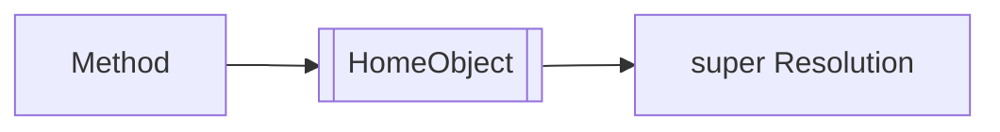

# CH-01: Method Definitions

> **"Cara objek menerima perilaku yang tetap terhubung ke rumahnya sendiri."**

**Source Hub**:
- [ECMA-262: Method Definitions](https://tc39.es/ecma262/#sec-method-definitions)

---

## 1. Mental Model: "The Integrated Connector"

Method definition menempelkan fungsi langsung ke objek atau class dengan sintaks yang lebih ringkas dan kontrak internal yang lebih kaya.

---

## 2. Visualisasi Sistem: HomeObject Link

---

## 3. Mekanisme & Hubungan

1. Method definition dapat membawa `[[HomeObject]]`.
2. Slot ini penting untuk perilaku `super`.
3. Sintaks metode ringkas bukan sekadar gaya, tetapi membawa konsekuensi semantik.

---

## 4. Lab Praktis

Buka file `examples/01_method_definitions_lab.js` untuk melihat metode ringkas bekerja sebagai konektor perilaku objek.

---
*Status: [x] Complete | [status.md](../../../docs/status.md)*
