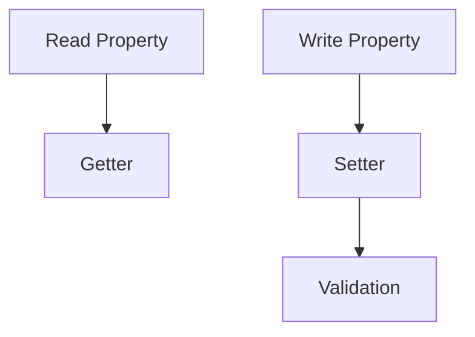

# CH-02: Flow Sensors (Getters and Setters)

> **"Accessor sebagai sensor pembacaan dan penulisan pada properti objek."**

**Source Hub**:
- [ECMA-262: Method Definitions](https://tc39.es/ecma262/#sec-method-definitions)

---

## 1. Mental Model: "The Access Filter"

Getter dan setter membuat properti terlihat biasa di permukaan, padahal ada logika yang berjalan saat akses terjadi.

---

## 2. Visualisasi Sistem: Accessor Sensor Flow

---

## 3. Mekanisme & Hubungan

1. Getter mengintersepsi `[[Get]]`.
2. Setter mengintersepsi `[[Set]]`.
3. Accessor cocok untuk menjaga invariant atau formatting ringan.

---

## 4. Lab Praktis

Buka file `examples/01_flow_sensors_lab.js` untuk melihat getter dan setter memfilter akses properti.

---
*Status: [x] Complete | [status.md](../../../docs/status.md)*
