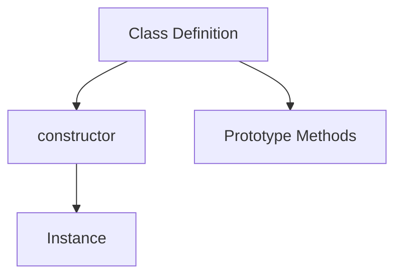

# CH-01: Class Construction

> **"Cara blueprint class membentuk instance dan private state."**

**Source Hub**:
- [ECMA-262: Class Definitions](https://tc39.es/ecma262/#sec-class-definitions)

---

## 1. Mental Model: "The Blueprint"

Class mendeskripsikan proses perakitan objek:
- constructor menetapkan state awal,
- metode dibagikan melalui prototype,
- private fields menjaga state internal tetap tertutup.

---

## 2. Visualisasi Sistem: Class Construction Flow

---

## 3. Mekanisme & Hubungan

1. Class tetap berdiri di atas sistem prototype, bukan tipe baru yang terpisah.
2. Constructor berjalan pada saat `new` dipanggil.
3. Private field memberi isolasi data yang lebih kuat dibanding pola lama berbasis konvensi.

---

## 4. Lab Praktis

Buka file `examples/01_class_construction_lab.js` untuk melihat constructor dan private field bekerja bersama.

---
*Status: [x] Complete | [status.md](../../../docs/status.md)*
