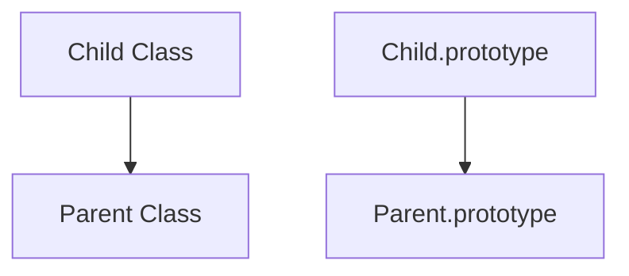

# CH-02: Heritage Chains

> **"Rantai pewarisan yang menghubungkan blueprint turunan ke basis prototipe induknya."**

**Source Hub**:
- [ECMA-262: Class Definitions](https://tc39.es/ecma262/#sec-class-definitions)

---

## 1. Mental Model: "The Energy Heritage"

Heritage chain memungkinkan class baru membangun diri di atas blueprint lama melalui `extends` dan `super`.

---

## 2. Visualisasi Sistem: Heritage Chain

---

## 3. Mekanisme & Hubungan

1. `extends` membangun hubungan prototype di dua level: constructor dan instance methods.
2. `super()` mengaktifkan inisialisasi induk sebelum `this` dipakai di subclass.
3. Overriding bekerja di atas rantai ini tanpa memutus akses ke perilaku induk.

---

## 4. Lab Praktis

Buka file `examples/01_heritage_chains_lab.js` untuk melihat subclass memodifikasi output perilaku induknya.

---
*Status: [x] Complete | [status.md](../../../docs/status.md)*
