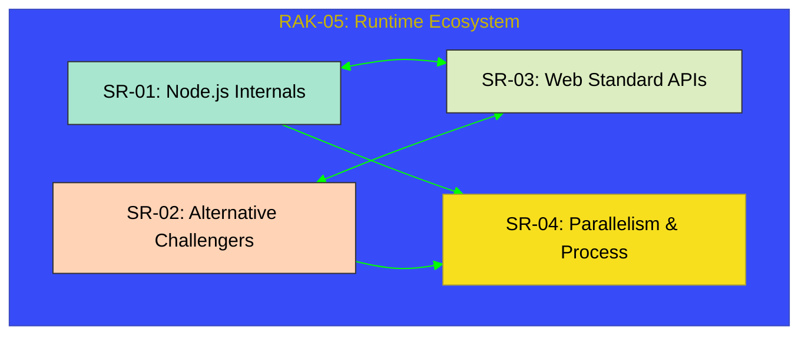

# RAK-05: Modern Runtime APIs

> **"The Execution Ecosystem: Dekonstruksi Arsitektur Runtime JavaScript Modern dari Fondasi Node.js hingga Kecepatan Bun dan Keamanan Deno."**

---

## 🌓 1. Essence: The Narrative

### Dual Definition
- **Formal**: Dokumentasi arsitektur runtime JavaScript di luar browser yang mencakup manajemen I/O asinkron, sistem modul, keamanan sandbox, dan paralelisme. RAK-05 membedah bagaimana kode JavaScript berinteraksi dengan sistem operasi melalui perantara **Node.js**, **Bun**, dan **Deno**, serta kepatuhan terhadap standar **WinterCG**.
- **Analogi**: Bayangkan JavaScript adalah **Seorang Koki Berbakat (JS Core)**. Tanpa dapur yang lengkap, koki tersebut tidak bisa memasak. RAK-05 adalah **Panduan Dapur Profesional**. Ia membahas bagaimana dapur raksasa (**Node.js**) bekerja, bagaimana dapur modular yang sangat aman (**Deno**) beroperasi, dan bagaimana dapur super cepat (**Bun**) bisa memproses pesanan dalam sekejap. Ini adalah tentang memahami infrastruktur tempat kode Anda "hidup".

---

## 🗺️ 2. Visual Logic: The 4-Hub Symphony

Pilar arsitektur runtime modern:

---

## 🏛️ 3. Strategic Hubs (Catalogs)

Dekonstruksi runtime secara komprehensif:

- **[SR-01: Node.js Core Internals](./SR-01_NodeJS/)**: Dekonstruksi Libuv, Event Loop, dan modularitas Titan.
- **[SR-02: Bun & Deno Ecosystem](./SR-02_BunDeno/)**: Membedah kecepatan Bun (Zig) dan keamanan Deno (Rust).
- **[SR-03: Web Standard APIs](./SR-03_WebStandards/)**: Standardisasi WinterCG (Fetch, Streams, URL) lintas-runtime.
- **[SR-04: Parallelism & Process](./SR-04_Parallelism/)**: Multitasking melalui Child Processes dan Worker Threads.

---

## 🎖️ 4. Gold Standard Checklist
- [x] **Spec-Alignment**: Sinkronisasi dengan WinterCG dan dokumentasi resmi runtime.
- [x] **Visual Logic**: 4 Hub Symphony Architecture Map.
- [x] **Normalization**: Konsolidasi materi Asynchronous dan Parallelism.

---
*Status: 🟢 **Gold Standard** (100% Verified) | Kembali ke [Root](../../status.md)*
