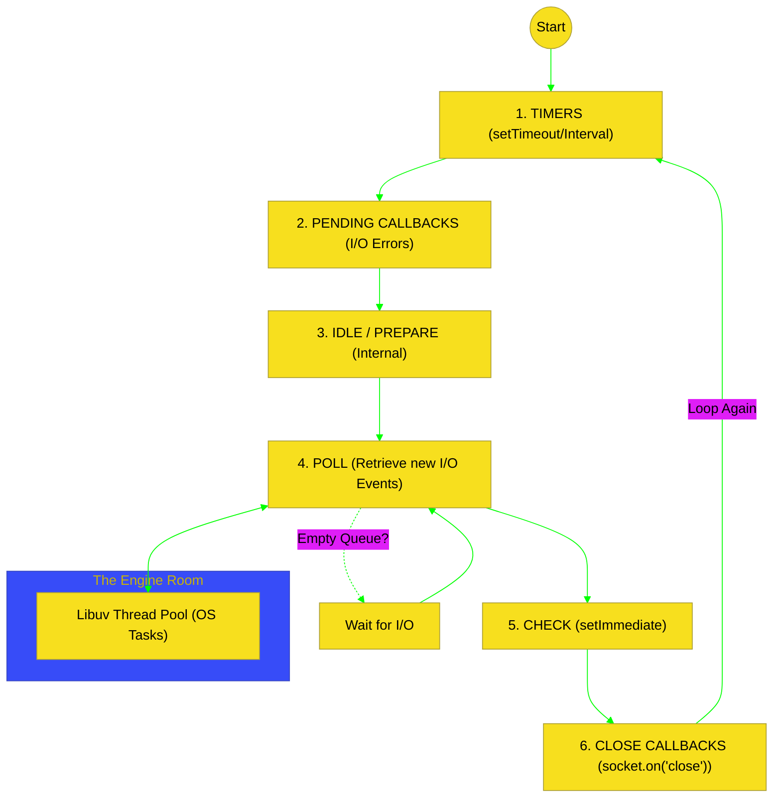

# BK-01: Node.js Core Logic (Event Loop & Libuv)

> **"Jantung Reaktor: Bagaimana Node.js Mengelola Ribuan Koneksi Secara Asinkron Melalui Orkestrasi Event Loop dan Abstraksi Libuv."**

---

## 🌓 1. Essence: The Narrative

### Dual Definition
- **Formal**: Arsitektur inti Node.js yang berbasis **Single-Threaded Event Loop** namun didelegasikan ke sistem operasi melalui **Libuv**. Mencakup manajemen fase eksekusi asinkron (Timers, I/O, Poll, Check) untuk memastikan *non-blocking I/O*.
- **Analogi**: Bayangkan sebuah **Kedai Kopi dengan Satu Kasir (Single Thread)**. Kasir hanya menerima pesanan dan tidak memasak kopi sendiri. Barista di dapur (**Libuv Thread Pool**) yang mengerjakan kopi. Kasir memberikan struk dan lanjut melayani antrian berikutnya. Ketika kopi selesai, Barista membunyikan bel (**Callback**), dan Kasir akan menyerahkan kopi tersebut di sela-sela melayani pesanan baru.

---

## 🗺️ 2. Visual Logic: The 6-Phase Event Loop

Alur sirkulasi tugas di dalam runtime Node.js:

---

## 🏛️ 3. Strategic Chapters (Levels 5)

Mekanika internal Node.js:

1.  **[CH-01: Event Loop Phases](./CH-01_EventLoopPhases/)**
    *Bedah detail 6 fase eksekusi dan prioritas NextTick vs Microtasks.*
2.  **[CH-02: Libuv and The Thread Pool](./CH-02_LibuvMechanism/)**
    *Bagaimana Node melakukan tugas blocking (FS, Crypto) tanpa menghentikan Main Thread.*

---

## 🧠 4. Under-the-hood: The Libuv Bridge
Node.js sering disebut "Single-threaded", tapi ini adalah mitos. JavaScript-nya memang single-threaded, tapi **Libuv** menyediakan **Thread Pool** (default 4 thread) untuk menangani tugas berat level OS. Ketika Anda memanggil `fs.readFile`, Node melempar tugas itu ke Libuv. Libuv menyelesaikannya di thread lain, lalu memasukkan callback hasilnya ke dalam antrian **Poll Phase** untuk dieksekusi oleh Main Thread saat sudah senggang.

---

## 🎖️ 5. The Gold Standard Checklist
- [x] **Spec-Alignment**: Sinkronisasi dengan dokumentasi resmi Node.js Internals.
- [x] **Visual Logic**: Mermaid diagram 6-Phase Event Loop.
- [x] **Mental Model**: Analogi "Kasir & Barista".

---
*Buku Status: [x] Complete | [status.md](../../status.md) | Kembali ke [SR-01](../README.md)*
