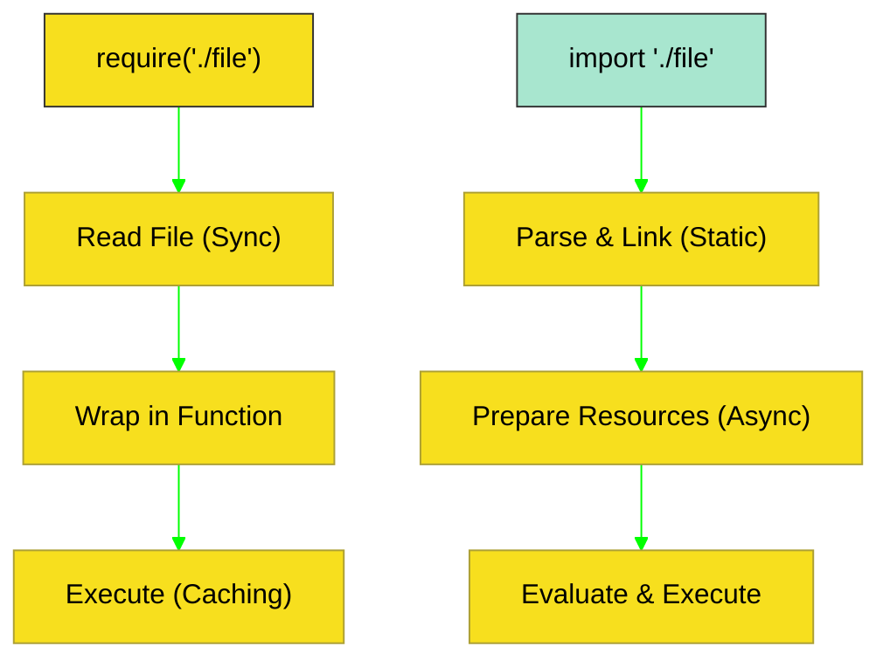

# BK-02: Module Synergy (CJS vs ESM)

> **"Sinergi Grid: Bagaimana Node.js Memetakan Jalur Koneksi Antar-File Melalui Evolusi dari CommonJS (Sinkron) Menuju ES Modules (Asinkron)."**

---

## 🌓 1. Essence: The Narrative

### Dual Definition
- **Formal**: Spesifikasi mengenai sistem pemuatan modul dalam Node.js. Mencakup **CommonJS (CJS)** yang bersifat sinkron dan berbasis `require()`, serta **ES Modules (ESM)** yang bersifat asinkron, sesuai spek ECMA, dan berbasis `import/export`. Keduanya memiliki algoritma resolusi yang berbeda namun dapat berinteroperasi di bawah kondisi tertentu.
- **Analogi**: Bayangkan **Dua Sistem Listrik dalam Satu Rumah**. CommonJS adalah **Sistem Colokan Lama (Stop Kontak Dinding)**; dayanya mengalir seketika saat Anda memasangnya (Sinkron). ESM adalah **Sistem Listrik Pintar (Smart Home)**; ia membutuhkan pemeriksaan keamanan dan negosiasi daya sebelum benar-benar memberikan energi (Asinkron). Node.js adalah adaptor yang memastikan perangkat lama dan baru bisa tetap berjalan bersama.

---

## 🗺️ 2. Visual Logic: CJS vs ESM Resolution Flow

Perbedaan fundamental dalam cara file dimuat dan dieksekusi:

---

## 🏛️ 3. Strategic Chapters (Levels 5)

Manajemen konektivitas file:

1.  **[CH-01: CommonJS Resolution](./CH-01_CJSResolution/)**
    *Algoritma require.resolve, caching, dan masalah circular dependencies.*
2.  **[CH-02: The ESM Horizon](./CH-02_ESMInterop/)**
    *Top-level await, import maps, dan interop dengan legacy CJS.*

---

## 🧠 4. Under-the-hood: The Wrapper vs The Graph
Dalam **CommonJS**, Node.js membungkus setiap file ke dalam sebuah fungsi `(function(exports, require, module, __filename, __dirname) { ... })`. Inilah mengapa `require` dan `__dirname` tersedia seolah-olah global. Dalam **ESM**, Node.js menggunakan **Module Map** dan **Static Analysis**. ESM membangun "pohon ketergantungan" secara utuh sebelum mengeksekusi sebaris kode pun, yang memungkinkan fitur seperti *Tree Shaking* dan pemuatan asinkron lintas jaringan.

---

## 🎖️ 5. The Gold Standard Checklist
- [x] **Spec-Alignment**: Sesuai dengan Node.js Module API dan ECMA Module Spec.
- [x] **Visual Logic**: Mermaid diagram perbandingan CJS vs ESM.
- [x] **Mental Model**: Analogi "Sistem Listrik Lama vs Sistem Listrik Pintar".

---
*Buku Status: [x] Complete | [status.md](../../status.md) | Kembali ke [SR-01](../README.md)*
