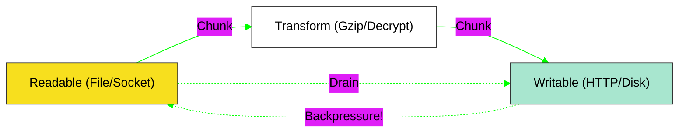

# BK-03: Fast-Track APIs
# BK-03: FastTrack APIs (Buffers & Streams)

> **"Pipa Penjalur & Kontainer: Bagaimana Node.js Mengelola Aliran Data Masif Terus-Menerus Tanpa Menghabiskan Memori Melalui Mekanisme Buffer dan Stream."**

---

## 🌓 1. Essence: The Narrative

### Dual Definition
- **Formal**: Kumpulan API fundamental Node.js untuk manipulasi data biner (**Buffer**) dan aliran data kontinu (**Streams**). Mencakup sistem **Backpressure** untuk menyeimbangkan kecepatan antara pembaca (Reader) dan penulis (Writer), serta integrasi dengan **Async Iterators**.
- **Analogi**: Bayangkan **Mengisi Kolam Renang Menggunakan Selang**. Jika Anda menyedot seluruh air kolam ke dalam satu tangki besar (**readFileSync/Buffer**) sekaligus, tangki tersebut akan meledak karena terlalu berat (Memory Overflow). Sebaliknya, **Streams** adalah selang yang mengalirkan air sedikit demi sedikit. Jika kolam mulai meluap karena pengisian terlalu cepat, Anda mengecilkan keran sejenak (**Backpressure**) sampai air di kolam surut, lalu membukanya lagi.

---

## 🗺️ 2. Visual Logic: The Stream Pipeline

Bagaimana data mengalir melalui transformasi sebelum sampai ke tujuan:

---

## 🏛️ 3. Strategic Chapters (Levels 5)

Optimalisasi I/O data biner:

1.  **[CH-01: Buffer Internals](./CH-01_BufferInternals/)**
    *Alokasi memori di luar V8 Heap (C++ memory) dan manipulasi byte-level.*
2.  **[CH-02: Stream Protocols](./CH-02_StreamProtocols/)**
    *Readable, Writable, Duplex, dan Transform. Menangani Backpressure secara efisien.*

---

## 🧠 4. Under-the-hood: The Backpressure Signal
Dalam Node.js, `readable.pipe(writable)` bukan sekadar memindahkan data. Jika `writable` tidak bisa menulis secepat `readable` membaca, internal buffer pada `writable` akan penuh. Pada titik ini, `writable.write()` akan mengembalikan `false`. Node akan segera memicu **Backpressure**, memberi tahu `readable` untuk berhenti membaca sejenak. Setelah buffer `writable` kosong, ia akan memicu event `'drain'`, dan aliran data akan dilanjutkan otomatis.

---

## 🎖️ 5. The Gold Standard Checklist
- [x] **Spec-Alignment**: Sinkronisasi dengan Node.js Stream & Buffer API.
- [x] **Visual Logic**: Mermaid diagram Stream Pipeline & Backpressure.
- [x] **Mental Model**: Analogi "Selang & Kolam Renang".

---
*Buku Status: [x] Complete | [status.md](../../status.md) | Kembali ke [SR-01](../README.md)*
