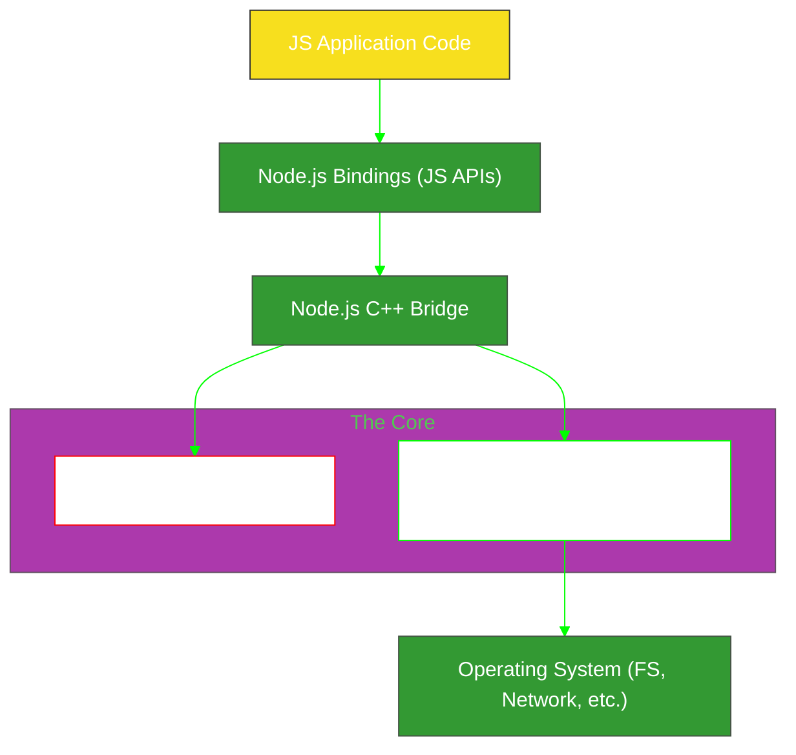

# SR-01: Node.js Core Internals

> **"The V8 Engine on Steroids: Dekonstruksi Arsitektur Runtime Server-side Paling Dominan yang Mengubah JavaScript Menjadi Kekuatan Industri."**

---

## 🌓 1. Essence: The Narrative

### Dual Definition
- **Formal**: Runtime JavaScript yang dibangun di atas mesin **V8 Chrome** dan library asinkron **Libuv**. Node.js mendefinisikan ekosistem di luar browser melalui sistem modul CJS/ESM, manajemen I/O non-blocking, serta API sistem operasi (FS, Net, OS).
- **Analogi**: Jika V8 adalah **Mesin Mobil (Engine)** yang sangat kencang, Node.js adalah **Seluruh Kendaraannya**. Ia memiliki sasis (**Libuv**), tangki bahan bakar (**Buffer**), sistem transmisi (**Event Loop**), dan GPS (**Module Resolution**). Tanpa kendaraan ini, mesin V8 tetap hebat tapi tidak bisa membawa kita ke mana-mana (tidak bisa mengakses file atau jaringan secara langsung).

---

## 🗺️ 2. Visual Logic: Node.js Runtime Architecture

Bagaimana komponen internal berkolaborasi:

---

## 🏛️ 3. Strategic Books (5 Tracks)

Dekonstruksi runtime secara modular:

1.  **[BK-01: Node.js Core Logic (Event Loop & Libuv)](./BK-01_CoreLogic/)**
2.  **[BK-02: Module Synergy (CJS vs ESM)](./BK-02_ModuleSynergy/)**
3.  **[BK-03: FastTrack APIs (Buffers & Streams)](./BK-03_FastTrackAPIs/)**
4.  **[BK-04: Network Architecture (HTTP & Sockets)](./BK-04_NetworkArchitecture/)**
5.  **[BK-05: Asynchronous Runtime (Node Context)](./BK-05_AsynchronousRuntime/)**

---

## 🧠 4. Under-the-hood: The C++ Bridge
Node.js bukanlah "JavaScript yang berjalan di server"; ia adalah **Aplikasi C++** yang menyisipkan (embed) mesin V8. Sebagian besar API Node (seperti `fs`) hanyalah "jembatan" (bindings) yang memanggil fungsi aslinya di level C++. Inilah mengapa Node.js bisa melakukan hal-hal yang dilarang di browser (seperti menghapus file di hardcom), karena ia memiliki izin akses sistem operasi melalui perantara C++.

---

## 🎖️ 5. The Gold Standard Checklist
- [x] **Spec-Alignment**: Sinkronisasi dengan arsitektur Node.js v20+.
- [x] **Visual Logic**: Mermaid Architecture Diagram.
- [x] **Consolidation**: Penggabungan materi Asynchronous (BK-05) ke dalam Hub.

---
*Status: 🟢 **Gold Standard** | Kembali ke [RAK-05](../README.md)*
