# BK-01: Deno Fundamentals (The Secure Runtime)

> **"Benteng Keamanan: Bagaimana Deno Memperbaiki Kesalahan Arsitektur Node.js Melalui Sistem Sandbox yang Ketat dan Integrasi Rust yang Sangat Aman."**

---

## 🌓 1. Essence: The Narrative

### Dual Definition
- **Formal**: Runtime JavaScript modern yang dibangun menggunakan bahasa **Rust** dan mesin **V8**. Deno berfokus pada keamanan "Secure by Default" (Sandbox), pemuatan modul berbasis URL (ESM), serta dukungan *first-class* untuk TypeScript dan Web Standard APIs.
- **Analogi**: Jika Node.js adalah **Rumah tanpa Pagar** (di mana tamu bisa langsung masuk ke dapur dan mengambil pisau atau kunci mobil), Deno adalah **Apartemen Mewah dengan Resepsionis**. Tidak ada tamu (skrip) yang bisa mengakses internet, file, atau folder Anda kecuali Anda memberikan kartu akses (**Permissions**) secara eksplisit di depan pintu masuk.

---

## 🗺️ 2. Visual Logic: Deno Security Sandbox

Mekanisme kontrol akses terhadap resource sistem:

```mermaid
%%{init: {'theme': 'base', 'themeVariables': { 'primaryColor': '#000', 'primaryTextColor': '#fff', 'lineColor': '#00BFFF'}}}%%
graph TD
    Script["JS/TS Execution"] --> Sandbox{Sandbox?}
    
    subgraph "The Gatekeeper"
        Sandbox -->|--allow-net| NET["Network Access"]
        Sandbox -->|--allow-read| READ["File Read Access"]
        Sandbox -->|--allow-write| WRITE["File Write Access"]
    end
    
    Sandbox -->|Denied| Error["PermissionDenied Error"]
    
    NET & READ & WRITE --> OS["Operating System"]

    style Sandbox fill:#000,stroke:#00BFFF
    style Error fill:#fff,stroke:#ff0000
```

---

## 🏛️ 3. Strategic Chapters (Levels 5)

Filosofi dan keamanan runtime:

1.  **[CH-01: Secure by Default Architecture](./CH-01_DenoFundamentals/)**
    *Bedah sistem permission (`--allow-*`) dan isolasi V8.*
2.  **[CH-02: URL-based Module Management](./CH-02_Node_Integration/)**
    *Mengapa Deno meninggalkan `node_modules` dan menggunakan cache modular berbasis URL.*

---

## 🧠 4. Under-the-hood: The Rust Bridge (deno_core)
Berbeda dengan Node.js yang menggunakan banyak C++ bindings, Deno dibangun di atas **`deno_core`**, sebuah crate Rust yang menyediakan interface minimalis antara Rust dan V8. Deno menggunakan model **Isolates** untuk menjalankan kode JavaScript. Setiap tugas asinkron diproses melalui **Rust Futures** dan dikelola oleh runtime **Tokio**, yang memberikan performa konkurensi yang sangat efisien dan aman tanpa risiko memori yang sering ditemukan di C++.

---

## 🎖️ 5. The Gold Standard Checklist
- [x] **Spec-Alignment**: Sinkronisasi dengan dokumentasi Deno Manual.
- [x] **Visual Logic**: Mermaid diagram Deno Security Sandbox.
- [x] **Mental Model**: Analogi "Apartemen Mewah & Resepsionis".

---
*Buku Status: [x] Complete | [status.md](../../status.md) | Kembali ke [SR-02](../README.md)*
