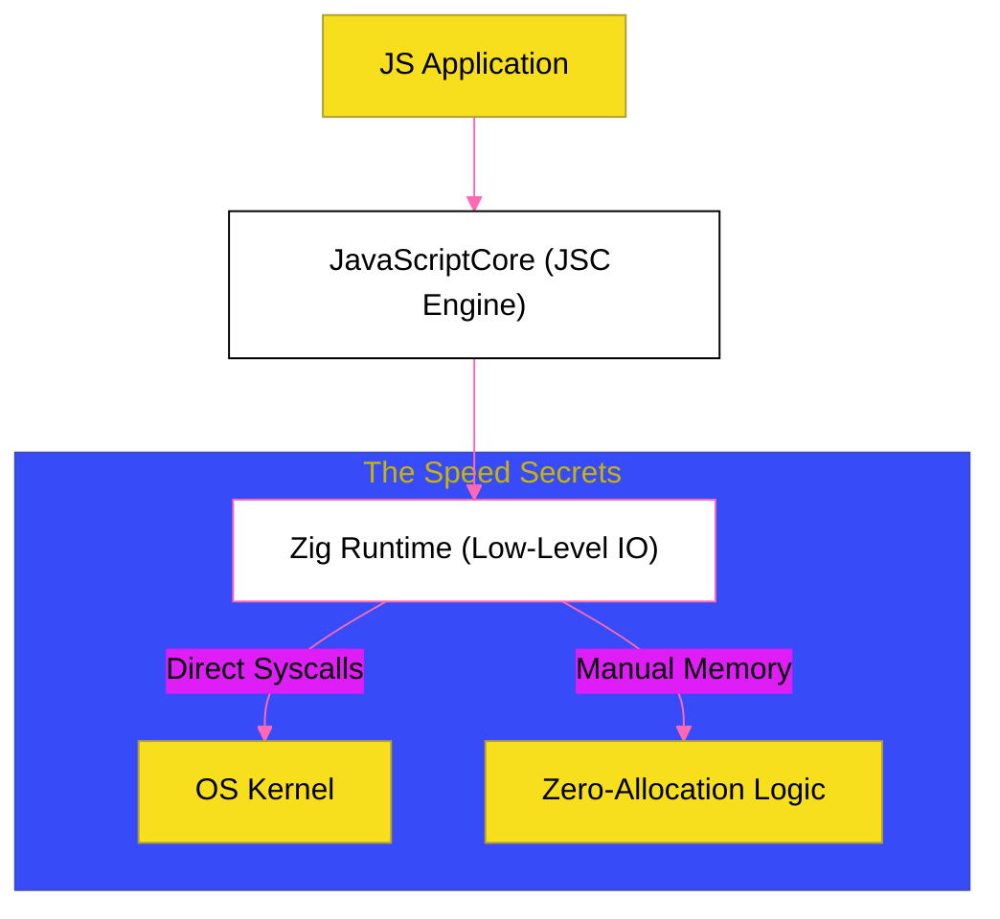

# BK-02: Bun Fundamentals (The Performance Speedster)

> **"Kecepatan Cahaya: Bagaimana Bun Melampaui Batas Performa Node.js Melalui Bahasa Zig dan Mesin JavaScriptCore yang Dioptimalkan untuk Cold-Start Minimal."**

---

## 🌓 1. Essence: The Narrative

### Dual Definition
- **Formal**: Runtime JavaScript, package manager, dan bundler serba guna yang ditulis dalam bahasa **Zig**. Bun menggunakan mesin **JavaScriptCore (JSC)** milik Apple dan dirancang untuk performa ekstrem, waktu startup yang sangat cepat, serta kompatibilitas penuh dengan ekosistem Node.js.
- **Analogi**: Jika Node.js adalah **Bus Kota yang Handal** (besar, stabil, tapi lambat untuk mulai jalan), Bun adalah **Jet Tempur**. Ia tidak membawa peralatan berat yang tidak perlu, dan mesinnya (**JSC**) dirancang untuk langsung "terbang" segera setelah tombol ditekan. Proses instalasi package di Bun terasa seperti mengedipkan mata karena ia menggunakan optimasi level rendah yang tidak dimiliki oleh runtime tradisional.

---

## 🗺️ 2. Visual Logic: Bun Performance Architecture

Bagaimana Bun mencapai efisiensi ekstrem:

---

## 🏛️ 3. Strategic Chapters (Levels 5)

Mekanika kecepatan ekstrem:

1.  **[CH-01: Bun Architecture & Zig](./CH-01_BunFundamentals/)**
    *Mengapa Zig memberikan kontrol memori yang lebih presisi daripada C++.*
2.  **[CH-02: JavaScriptCore (JSC) Integration](./CH-02_Module_Optimization/)**
    *Perbedaan filosofis antara V8 (Google) dan JSC (Apple) dalam konteks runtime server.*

---

## 🧠 4. Under-the-hood: The Zig Advantage
Bun ditulis dalam **Zig**, bahasa pemrograman sistem modern yang mengutamakan kontrol memori manual tanpa *hidden allocations*. Berbeda dengan Node.js (C++) yang memiliki banyak layer abstraksi, Bun melakukan **Direct System Calls**. Misalnya, saat membaca file, Bun memanggil API kernel sistem operasi secara langsung dengan overhead minimal. Penggunaan **JavaScriptCore** juga memberikan keuntungan pada *cold-start* (kecepatan awal eksekusi) karena JSC memiliki algoritma optimasi yang lebih agresif untuk skrip berumur pendek dibandingkan V8.

---

## 🎖️ 5. The Gold Standard Checklist
- [x] **Spec-Alignment**: Sinkronisasi dengan dokumentasi Bun documentation.
- [x] **Visual Logic**: Mermaid diagram Bun Performance Architecture.
- [x] **Mental Model**: Analogi "Jet Tempur vs Bus Kota".

---
*Buku Status: [x] Complete | [status.md](../../status.md) | Kembali ke [SR-02](../README.md)*
