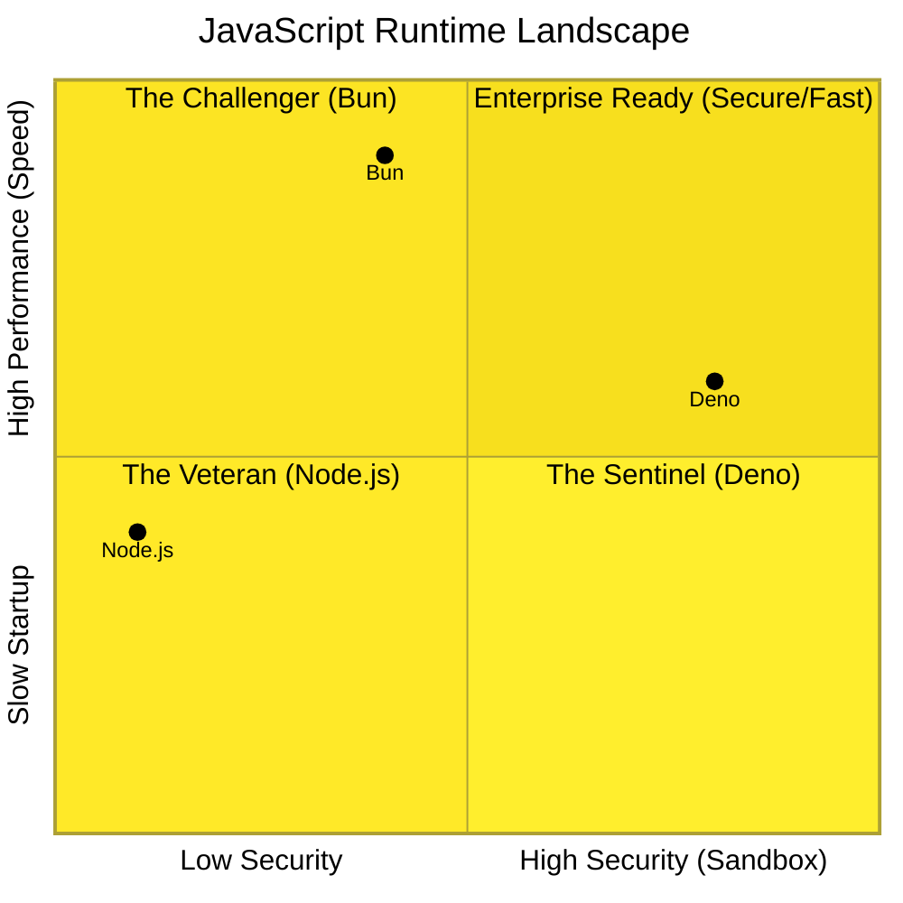

# BK-03: Runtimes Showdown (Node vs Deno vs Bun)

> **"Arena Duel: Membandingkan Tiga Raksasa Runtime JavaScript untuk Memahami Trade-off Antara Keamanan, Kecepatan, dan Kompatibilitas Sistem."**

---

## 🌓 1. Essence: The Narrative

### Dual Definition
- **Formal**: Analisis komparatif arsitektur antara Node.js, Deno, dan Bun. Fokus pada metrik performa (Cold start, Throughput), model keamanan (Sandbox vs Open), sistem modul (CJS vs ESM), serta ekosistem tooling (Native build-in vs Third-party).
- **Analogi**: Bayangkan memilih **Kendaraan untuk Ekspedisi**. **Node.js** adalah **Truk Kontainer** (Sangat besar, suku cadang ada di mana-mana, tapi berat untuk mulai jalan). **Deno** adalah **Mobil Lapis Baja** (Sangat aman, semuanya tertutup rapat, tapi jalannya agak kaku). **Bun** adalah **Sepeda Motor Superbike** (Sangat kencang, ringan, tapi mungkin terasa riskan karena pengembangannya yang sangat agresif).

---

## 🗺️ 2. Visual Logic: Runtime Comparison Matrix

Dimensi perbandingan utama:

---

## 🏛️ 3. Strategic Chapters (Levels 5)

Evaluasi teknis lintas runtime:

1.  **[CH-01: Performance Trade-offs](./CH-01_Comparisons/)**
    *Analisis throughput vs latency dan penggunaan Resource (RAM/CPU).*
2.  **[CH-02: Ecosystem Compatibility](./CH-02_Showdown/)**
    *Sejauh mana Bun dan Deno bisa menjalankan package dari npm tanpa modifikasi.*

---

## 🧠 4. Under-the-hood: The "Battery Included" Philosophy
Perbedaan filosofis terbesar terletak pada **Standard Library**. Node.js bersifat minimalis (banyak fungsi harus menggunakan `npm install`). Deno menyediakan `standard library` yang dikurasi oleh tim inti. Bun mengambil langkah lebih ekstrem dengan menyisipkan SQLite, Bundler, Hashing, dan Test Runner langsung ke dalam binary-nya. Hal ini mengurangi ketergantungan pada `node_modules` yang membengkak, namun meningkatkan ukuran binary runtime itu sendiri.

---

## 🎖️ 5. The Gold Standard Checklist
- [x] **Spec-Alignment**: Sinkronisasi dengan benchmark runtime terbaru (2024+).
- [x] **Visual Logic**: Mermaid Quadrant Chart Comparison.
- [x] **Mental Model**: Analogi "Truk vs Lapis Baja vs Superbike".

---
*Buku Status: [x] Complete | [status.md](../../status.md) | Kembali ke [SR-02](../README.md)*
