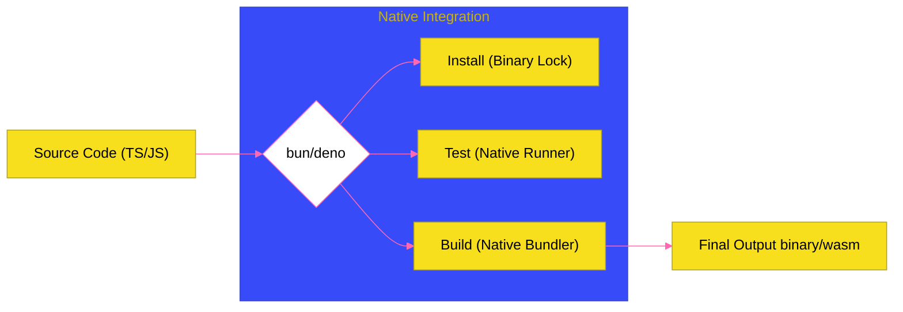

# BK-04: Tooling Ecosystem (Bundlers & Managers)

> **"Bengkel All-in-One: Bagaimana Runtime Modern Mengonsolidasi Tooling Eksternal Menjadi Alat Bawaan yang Jauh Lebih Cepat dan Terintegrasi."**

---

## 🌓 1. Essence: The Narrative

### Dual Definition
- **Formal**: Kumpulan utilitas pengembangan yang terintegrasi langsung ke dalam binary runtime (Deno & Bun). Mencakup **Package Manager** (pemuatan dependensi), **Bundler** (penggabungan file), **Test Runner** (validasi kode), dan **LSP** (Language Server Protocol).
- **Analogi**: Jika pengembangan Node.js tradisional adalah **Membangun Mobil secara Manual** (di mana Anda harus membeli kunci inggris, dongkrak, dan obeng dari toko yang berbeda-beda seperti Webpack, Jest, dan npm), runtime modern adalah **Pabrik Otomotif Terintegrasi**. Semua alat sudah ada di sana, bertenaga robotik (**Zig/Rust**), dan siap digunakan tanpa konfigurasi rumit.

---

## 🗺️ 2. Visual Logic: The Modern Tooling Pipeline

Efisiensi alur kerja tanpa overhead eksternal:

---

## 🏛️ 3. Strategic Chapters (Levels 5)

Konsolidasi alat pengembangan:

1.  **[CH-01: Native Bundlers & Build Tools](./CH-01_BunBuild/)**
    *Mengapa Bun.build() mengalahkan performa esbuild dan webpack.*
2.  **[CH-02: Native Test Runners](./CH-02_TestRunners/)**
    *Eksekusi pengujian dengan startup overhead nol.*
3.  **[CH-03: Dependency Management](./CH-03_DependencyManagement/)**
    *Mekanisme binary lockfile dan cache level sistem.*

---

## 🧠 4. Under-the-hood: The Binary Lockfile Strategy
Bun menggunakan format **Binary Lockfile (`bun.lockb`)** alih-alih file teks JSON (`package-lock.json`) yang besar. Hal ini memungkinkan Bun untuk mem-parsing dependensi ribuan kali lebih cepat melalui pembacaan memori langsung (*Direct Memory Mapping*). Di sisi lain, **Deno** mengintegrasikan **LSP** secara native, sehingga editor seperti VS Code tidak membutuhkan ekstensi pihak ketiga yang berat untuk memberikan *autocompletion* dan *error checking* yang akurat.

---

## 🎖️ 5. The Gold Standard Checklist
- [x] **Spec-Alignment**: Sinkronisasi dengan Tooling API Bun & Deno.
- [x] **Visual Logic**: Mermaid diagram Tooling Pipeline.
- [x] **Mental Model**: Analogi "Pabrik Otomotif Terintegrasi".

---
*Buku Status: [x] Complete | [status.md](../../status.md) | Kembali ke [SR-02](../README.md)*
