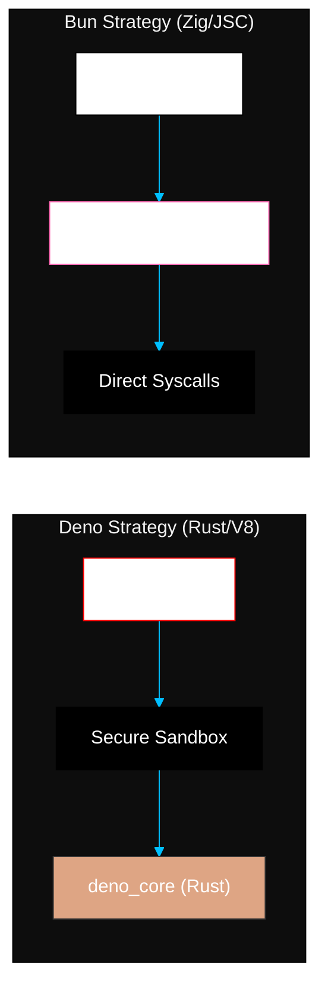

# SR-02: Bun & Deno (Modern Successors)

Sub-rak ini mengeksplorasi alternatif modern untuk Node.js yang menawarkan solusi untuk masalah keamanan dan performa masa lalu.

## SR-02: Bun & Deno Ecosystem

> **"Gelombang Kedua: Bagaimana Deno dan Bun Mendefinisikan Ulang Kecepatan dan Keamanan Runtime JavaScript untuk Menantang Status Quo Node.js."**

---

## 🌓 1. Essence: The Narrative

### Dual Definition
- **Formal**: Ekosistem runtime modern yang lahir untuk mengatasi keterbatasan historis Node.js. **Deno** berfokus pada keamanan pasir Isolate V8 dan penggunaan Rust, sementara **Bun** berfokus pada performa mentah melalui bahasa Zig dan mesin JavaScriptCore (JSC). Keduanya mengadopsi standar ESM dan Web APIs secara native.
- **Analogi**: Jika Node.js adalah **Bahasa Inggris Klasik** (banyak aturan tidak beraturan tapi digunakan semua orang), Deno adalah **Bahasa Esperanto** (sangat logis, aman, dan dirancang dengan sengaja), dan Bun adalah **Bahasa Slang Modern** (sangat cepat, efisien, dan lincah). Koleksi ini adalah panduan bagi Anda untuk memahami kapan harus menggunakan "Bahasa" yang tepat untuk proyek Anda.

---

## 🗺️ 2. Visual Logic: Alternative Runtime Architecture

Perbandingan fundamental antara mesin eksekusi:

---

## 🏛️ 3. Strategic Books (4 Tracks)

Eksplorasi ekosistem penantang:

1.  **[BK-01: Deno Fundamentals (The Secure Runtime)](./BK-01_DenoFundamentals/)**
2.  **[BK-02: Bun Fundamentals (The Performance Speedster)](./BK-02_BunFundamentals/)**
3.  **[BK-03: Runtimes Showdown (Node vs Deno vs Bun)](./BK-03_RuntimesShowdown/)**
4.  **[BK-04: Tooling Ecosystem (Bundlers & Managers)](./BK-04_ToolingEcosystem/)**

---

## 🧠 4. Under-the-hood: Isolate vs Bridge
Node.js sangat bergantung pada **C++ Bindings** yang terkadang menjadi bottleneck. **Deno** memanfaatkan keunggulan memori Rust untuk menjamin keamanan sandbox tanpa mengorbankan performa. **Bun** mengambil rute berbeda dengan menggunakan **Zig**, sebuah bahasa yang lebih dekat ke hardware daripada C++, memungkinkan Bun untuk melakukan optimasi I/O yang tidak mungkin dilakukan oleh V8.

---

## 🎖️ 5. The Gold Standard Checklist
- [x] **Spec-Alignment**: Sinkronisasi dengan WinterCG dan standar runtime modern.
- [x] **Visual Logic**: Mermaid Comparison Architecture.
- [x] **Mental Model**: Analogi "Bahasa Klasik vs Logis vs Slang".

---
*Status: 🟢 **Gold Standard** | Kembali ke [RAK-05](../README.md)*
