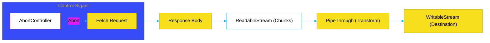

# BK-01: Fetch & Streams API (Universal I/O)

> **"Bahasa Pemersatu: Bagaimana Fetch dan Streams API Menghapus Sekat Antara Browser dan Server, Memungkinkan Kode I/O yang Benar-Benar Portabel Melalui Standar Web."**

---

## 🌓 1. Essence: The Narrative

### Dual Definition
- **Formal**: Implementasi standar **Fetch API** (pengambilan resource jaringan) dan **Streams API** (penanganan data kontinu) di lingkungan server-side. Standar ini menggantikan modul legacy seperti `http.request` di Node.js dengan interface berbasis Promise yang seragam dan interoperabel lintas-runtime (WinterCG).
- **Analogi**: Bayangkan **Bahasa Inggris dalam Bisnis Internasional**. Dahulu, setiap negara (Node, Browser, Deno) memiliki bahasa dagangnya sendiri. **Fetch & Streams** adalah bahasa universal yang disepakati bersama. Sekarang, Anda bisa menulis "kontrak" (kode I/O) di satu tempat dan menjalankannya di mana saja tanpa perlu penerjemah manual lagi.

---

## 🗺️ 2. Visual Logic: Web Stream Lifecycle

Alur data dalam ekosistem Web Streams modern:

---

## 🏛️ 3. Strategic Chapters (Levels 5)

Mekanika I/O universal:

1.  **[CH-01: The Fetch Protocol](./CH-01_FetchAPI/)**
    *Request, Response, Headers, dan penanganan Body (json/blob/text).*
2.  **[CH-02: Web Streams API](./CH-02_StreamsAPI/)**
    *Strategi Pull vs Push, manajemen Backpressure di Web Streams, dan piping.*

---

## 🧠 4. Under-the-hood: The WinterCG Alignment
Sebelum Node.js v18, `fetch` harus diinstal sebagai library eksternal (`node-fetch`). Saat ini, Node.js menggunakan engine **`undici`** untuk mengimplementasikan `fetch` secara native dengan performa tinggi. Perbedaan mendasar dengan sistem lama adalah **Streams API** di tingkat Web menggunakan *Underlying Source* yang berbasis Promise, berbeda dengan `node:stream` yang berbasis event. Sinkronisasi ini memastikan objek `Response` di Node.js bisa langsung dikonsumsi oleh library yang dikembangkan untuk browser.

---

## 🎖️ 5. The Gold Standard Checklist
- [x] **Spec-Alignment**: Sinkronisasi dengan WHATWG Streams & Fetch Spec.
- [x] **Visual Logic**: Mermaid diagram Web Stream Lifecycle.
- [x] **Mental Model**: Analogi "Bahasa Inggris Bisnis Internasional".

---
*Buku Status: [x] Complete | [status.md](../../status.md) | Kembali ke [SR-03](../README.md)*
