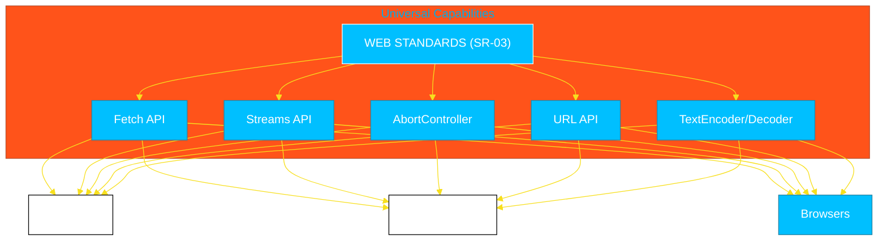

# SR-03: Web Standard APIs (The Unified Bridge)

> **"Jembatan Universal: Bagaimana JavaScript Modern Melenyapkan Batasan Antara Browser dan Server Melalui Standardisasi API yang Dipelopori oleh WinterCG."**

---

## 🌓 1. Essence: The Narrative

### Dual Definition
- **Formal**: Koleksi API yang mengimplementasikan standar **WHATWG** dan **W3C** dalam lingkungan runtime server-side. Melalui inisiatif **WinterCG** (Web-interoperable Runtimes Community Group), standar ini memastikan bahwa interface fundamental (Fetch, Streams, URL, AbortController) memiliki perilaku yang konsisten di seluruh ekosistem JavaScript tanpa ketergantungan pada runtime spesifik.
- **Analogi**: Bayangkan **Rel Kereta Api Standar Internasional**. Dahulu, setiap negara memiliki lebar rel yang berbeda (Node punya API sendiri, Deno punya sendiri). **SR-03** adalah standarisasi lebar rel kereta tersebut. Sekarang, "kereta" (kode Anda) bisa melintas dari satu negara ke negara lain tanpa harus mengganti roda (refactoring).

---

## 🗺️ 2. Visual Logic: The WinterCG Common Set

API minimum yang harus didukung oleh runtime modern untuk interoperabilitas:

---

## 🏛️ 3. Strategic Books (2 Tracks)

Fondasi interoperabilitas web:

1.  **[BK-01: Fetch & Streams API (Universal I/O)](./BK-01_FetchStreams/)**
2.  **[BK-02: Web Interoperability (URL & AbortController)](./BK-02_WebInterop/)**

---

## 🧠 4. Under-the-hood: Why Standardization Matters?
Standardisasi melalui **WinterCG** sangat krusial karena ia mencegah "vendor lock-in". Jika Anda membangun library yang menggunakan `fetch` dan `ReadableStream` standar, library tersebut otomatis dapat digunakan di Edge Computing (Cloudflare Workers), Serverless (AWS Lambda), hingga aplikasi Frontend. Ini adalah pergeseran paradigma dari "Node-first" menjadi "Web-first" dalam pengembangan backend JavaScript.

---

## 🎖️ 5. The Gold Standard Checklist
- [x] **Spec-Alignment**: Sinkronisasi dengan WinterCG Minimum Common API.
- [x] **Visual Logic**: Mermaid Common API Map.
- [x] **Mental Model**: Analogi "Rel Kereta Standar Internasional".

---
*Status: 🟢 **Gold Standard** | Kembali ke [RAK-05](../README.md)*
