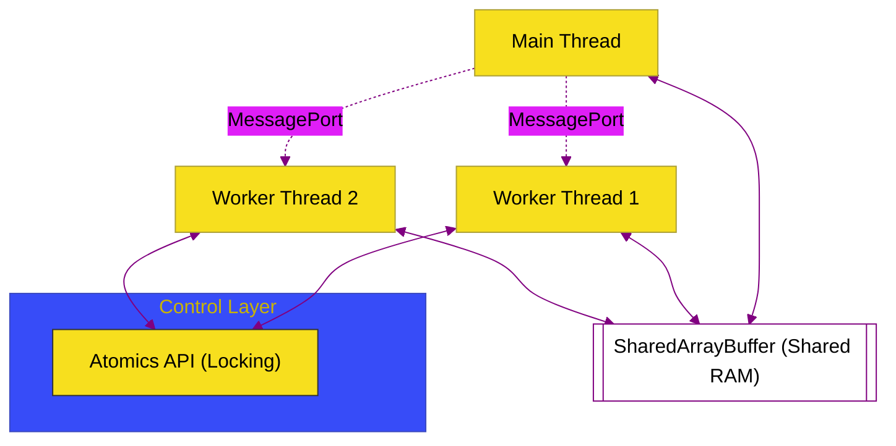

# BK-02: Worker Threads (True Multi-threading)

> **"Kekuatan Kolektif: Bagaimana Node.js Menembus Batas Single-Thread Melalui Pemanfaatan Worker Threads yang Memungkinkan Pemrosesan Paralel Sesungguhnya dengan Memori Terbagi."**

---

## 🌓 1. Essence: The Narrative

### Dual Definition
- **Formal**: Implementasi multi-threading dalam Node.js melalui modul `worker_threads`. Berbeda dengan child processes, worker threads berjalan di dalam proses yang sama dan dapat berbagi memori secara efisien melalui **SharedArrayBuffer**. Setiap worker memiliki V8 isolate dan event loop sendiri, menjadikannya solusi ideal untuk tugas-tugas **CPU-intensive**.
- **Analogi**: Ibukan sekelompok **Karyawan dalam Satu Meja Rancang (Worker Threads)**. Semua Karyawan bekerja di ruangan yang sama dan bisa melihat **Kertas Gambar yang Sama (Shared Memory)** secara bersamaan. Mereka tidak perlu menelepon (IPC) hanya untuk memberi tahu bahwa garis telah diubah; mereka cukup melihat kertas tersebut. Namun, mereka butuh koordinasi agar tidak menggambar di titik yang sama secara bersamaan (**Atomics**).

---

## 🗺️ 2. Visual Logic: Worker Shared Memory

Mekanisme berbagi data tanpa duplikasi memori:

---

## 🏛️ 3. Strategic Chapters (Levels 5)

Eksploitasi multi-threading JS:

1.  **[CH-01: Multi-threading Architecture](./CH-01_ExecutionModes/)**
    *Membedah V8 Isolates, Contexts, dan siklus hidup Worker.*
2.  **[CH-02: Shared Memory & Atomics](./CH-02_IPCChannels/)**
    *Teknik transfer data tanpa salinan (zero-copy) dan sinkronisasi thread.*

---

## 🧠 4. Under-the-hood: Isolate vs Thread
Berbeda dengan `child_process`, `worker_threads` tidak membuat proses OS baru. Sebaliknya, Node.js membuat **V8 Isolate** baru di dalam thread baru dalam proses yang sama. Karena mereka berada di satu proses, mereka bisa mengakses memori fisik yang sama (Shared Memory). Namun, JavaScript di dalamnya tetaplah "single-threaded" dalam konteks worker tersebut; sinkronisasi antar-thread harus dikelola secara manual menggunakan objek **`Atomics`** untuk mencegah *race conditions*.

---

## 🎖️ 5. The Gold Standard Checklist
- [x] **Spec-Alignment**: Sinkronisasi dengan Node.js Worker Threads API & ECMA Shared Memory.
- [x] **Visual Logic**: Mermaid diagram Worker Shared Memory.
- [x] **Mental Model**: Analogi "Karyawan Satu Meja Rancang".

---
*Buku Status: [x] Complete | [status.md](../../status.md) | Kembali ke [SR-04](../README.md)*
