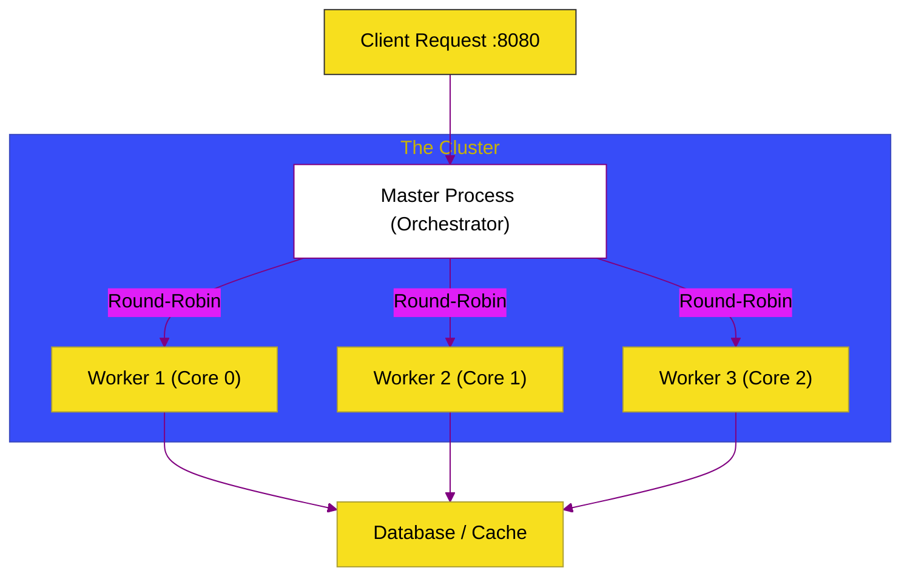

# BK-03: Cluster Mode (Scaling & Load Balancing)

> **"Penggandaan Kekuatan: Bagaimana Node.js Mengeksploitasi Seluruh Core CPU Melalui Mekanisme Cluster yang Membagi Beban Koneksi Secara Merata ke Beberapa Instansi Anak."**

---

## 🌓 1. Essence: The Narrative

### Dual Definition
- **Formal**: Modul bawaan Node.js (`cluster`) yang memungkinkan pembuatan jaringan proses anak (*worker*) yang semuanya berbagi port server yang sama. Setiap *worker* adalah instance Node.js yang berdiri sendiri, dan proses *master* bertugas untuk mengelola distribusi koneksi masuk (secara default menggunakan algoritma **Round-Robin**).
- **Analogi**: Ibukan sekelompok **Resepsionis di Hotel Besar (Cluster Workers)**. Semua resepsionis standby di belakang satu meja panjang (Satu Port). Ada satu **Manajer (Master Process)** di depan pintu masuk yang bertugas mengarahkan setiap tamu yang masuk ke resepsionis yang sedang kosong. Dengan cara ini, satu resepsionis tidak akan kewalahan, dan hotel bisa melayani lebih banyak tamu secara bersamaan.

---

## 🗺️ 2. Visual Logic: Cluster Load Balancing

Alur distribusi koneksi dari luar menuju worker:

---

## 🏛️ 3. Strategic Chapters (Levels 5)

Eskalasi beban kerja:

1.  **[CH-01: Cluster Architecture](./CH-01_ExecutionModes/)**
    *Mekanisme sharing socket dan siklus hidup master/worker.*
2.  **[CH-02: Scaling Strategy](./CH-02_IPCChannels/)**
    *Menentukan jumlah worker ideal berdasarkan jumlah CPU Core dan manajemen state.*

---

## 🧠 4. Under-the-hood: The Round-Robin Logic
Dalam sistem operasi berbasis Unix, proses *master* secara default mendengarkan (listen) pada port tertentu dan mendistribusikan koneksi baru ke *worker* menggunakan algoritma **Round-Robin**. Ini memastikan beban kerja terbagi secara adil. Namun, perlu diperhatikan bahwa setiap *worker* memiliki memori yang terisolasi. Jika Anda menyimpan sesi (session) di memori satu *worker*, *worker* lain tidak akan mengenalnya. Oleh karena itu, penggunaan *store* eksternal seperti Redis sangat krusial dalam mode Cluster.

---

## 🎖️ 5. The Gold Standard Checklist
- [x] **Spec-Alignment**: Sinkronisasi dengan Node.js Cluster Module API.
- [x] **Visual Logic**: Mermaid diagram Cluster Load Balancing.
- [x] **Mental Model**: Analogi "Resepsionis Hotel & Manajer".

---
*Buku Status: [x] Complete | [status.md](../../status.md) | Kembali ke [SR-04](../README.md)*
