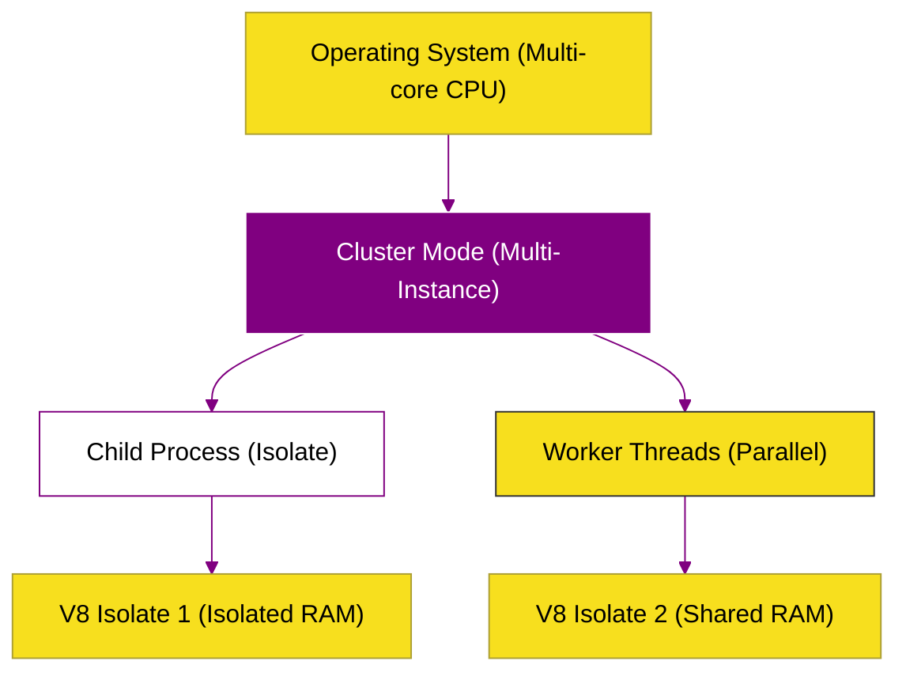

# SR-04: Parallelism & Process (The Orchestrator)

> **"Orkestrasi Multitasking: Bagaimana Runtime Modern Melampaui Batas Single-Threaded Melalui Manajemen Proses dan Threading yang Terstruktur untuk Skalabilitas Maksimum."**

---

## 🌓 1. Essence: The Narrative

### Dual Definition
- **Formal**: Strategi eksekusi paralel dalam JavaScript runtime untuk menangani beban kerja yang membutuhkan komputasi CPU-intensive atau isolasi proses tingkat tinggi. Mencakup penggunaan **Child Processes** (isolasi total), **Worker Threads** (paralelisme memori terbagi), dan **Cluster Mode** (skalabilitas berbasis core CPU).
- **Analogi**: Bayangkan **Mengelola Sebuah Restoran Besar**. Jika Anda hanya punya satu koki (Single Thread), restoran akan lambat. **SR-04** mengajarkan Anda tiga cara untuk mempercepatnya: **Child Process** adalah membuka restoran cabang di kota lain (Isolasi total). **Worker Threads** adalah menambah asisten koki di dapur yang sama yang berbagi oven yang sama (Parallelism). **Cluster Mode** adalah menambah jumlah resepsionis di depan pintu masuk agar tamu tidak mengantre lama (Load Balancing).

---

## 🗺️ 2. Visual Logic: The Parallel Hierarchy

Tingkatan multitasking dalam ekosistem JavaScript:

---

## 🏛️ 3. Strategic Books (3 Tracks)

Manajemen tenaga kerja digital:

1.  **[BK-01: Child Process (Spawning & IPC)](./BK-01_ChildProcess/)**
2.  **[BK-02: Worker Threads (True Multi-threading)](./BK-02_WorkerThreads/)**
3.  **[BK-03: Cluster Mode (Scaling & Load Balancing)](./BK-03_ClusterMode/)**

---

## 🧠 4. Under-the-hood: Why Multitasking matters?
Meskipun kekuatan utama Node.js ada pada I/O asinkron, ada kondisi di mana CPU-bound task (perhitungan matematika berat, pemrosesan video, enkripsi) akan memblokir Event Loop utama. Tanpa **SR-04**, seluruh aplikasi akan berhenti merespons. Memahami kapan harus menggunakan *Process* (untuk keamanan) versus *Threads* (untuk efisiensi data) adalah pembeda antara developer backend pemula dan arsitek sistem yang handal.

---

## 🎖️ 5. The Gold Standard Checklist
- [x] **Spec-Alignment**: Sinkronisasi dengan Node.js Multitasking guide.
- [x] **Visual Logic**: Mermaid diagram Parallel Hierarchy.
- [x] **Mental Model**: Analogi "Restoran Besar & Koki".

---
*Status: 🟢 **Gold Standard** | Kembali ke [RAK-05](../README.md)*
