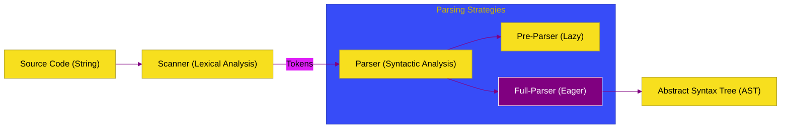

# CH-01: Scanner & Parser (The Front-end)

> **"Gerbang Masuk: Bagaimana V8 Mengubah Teks Mentah JavaScript Menjadi Struktur Data Abstrak (AST) yang Siap Dieksekusi."**

---

## 🌓 1. Essence: The Narrative

### Dual Definition
- **Formal**: Tahap awal dalam pipeline eksekusi V8 di mana **Scanner** melakukan analisis leksikal untuk memecah string kode menjadi token, dan **Parser** melakukan analisis sintaksis untuk membangun **Abstract Syntax Tree (AST)** berdasarkan aturan tata bahasa bahasa JavaScript.
- **Analogi**: Bayangkan **Translator Bahasa**. Scanner adalah proses membaca huruf demi huruf untuk mengenali kata (token). Parser adalah proses memahami struktur kalimat (subjek, predikat, objek) untuk membangun diagram alur cerita (AST). Tanpa tahap ini, mesin tidak akan tahu apakah `const x = 1` adalah perintah atau hanya teks biasa.

---

## 🗺️ 2. Visual Logic: The Front-end Flow

Alur transformasi dari Teks ke AST:

---

## 🏛️ 3. Under-the-hood: Lazy vs Eager Parsing
V8 sangat cerdas; ia tidak memparsing seluruh kode Anda sekaligus. Fungsi yang tidak segera dipanggil akan diproses oleh **Pre-Parser** (Lazy Parsing) yang hanya memeriksa kesalahan sintaksis ringan tanpa membangun AST. Hanya saat fungsi tersebut dipanggil, **Full-Parser** akan bekerja. Ini secara drastis mempercepat waktu startup aplikasi web yang besar.

---

## 📜 4. Architect's Principles (PPM V4)

1. **Minimize Initial Parsing**: Hindari membungkus seluruh kode dalam IIFE raksasa jika tidak diperlukan, karena ini akan memaksa Eager Parsing pada semua konten di dalamnya.
2. **Syntax over Comments**: Scanner harus melewati komentar. Meskipun komentar tidak masuk ke AST, terlalu banyak komentar dalam file produksi (yang tidak di-minify) bisa sedikit menambah beban kerja Scanner.
3. **Use Production Bundlers**: Minifikasi kode membantu Scanner bekerja lebih cepat karena jumlah karakter yang harus dibaca berkurang signifikan.

---

## 🎖️ 5. The Gold Standard Checklist
- [x] **Spec-Alignment**: Sinkronisasi dengan V8 Scanner and Parser specifications.
- [x] **Visual Logic**: Mermaid Front-end Flow diagram.
- [x] **Mental Model**: Analogi "Translator Bahasa".

---
*Status Bab: [x] Full Hardened | [status.md](../../status.md) | Kembali ke [BK-01](../README.md)*
