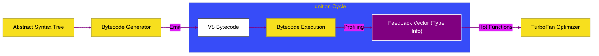

# CH-02: Ignition (The Fast-Start Interpreter)

> **"Penyulut Api: Memahami Cara Kerja Interpreter Ignition dalam Mengonversi AST Menjadi Bytecode dan Menghasilkan Feedback bagi Optimasi JIT."**

---

## 🌓 1. Essence: The Narrative

### Dual Definition
- **Formal**: Interpreter register-based berkinerja tinggi pada V8 yang bertugas mengonversi **Abstract Syntax Tree (AST)** menjadi **V8 Bytecode**. Ignition dirancang untuk meminimalkan konsumsi memori dan memberikan kecepatan startup yang instan, sambil mengumpulkan metrik performa (*Feedback Vectors*) untuk optimasi tahap selanjutnya.
- **Analogi**: Bayangkan **Koki Keliling (Interpreter)**. Ia tidak butuh dapur raksasa yang mahal. Begitu ia menerima resep (AST), ia langsung menyiapkan hidangan (Bytecode) di tempat. Koki ini sangat cepat memulai masakannya, tetapi karena ia memasak hidangan satu per satu tanpa bantuan mesin otomatis, ia tidak secepat pabrik robotik. Namun, sambil memasak, koki ini mencatat bahan apa yang paling sering diminta pelanggan (Optimization Feedback).

---

## 🗺️ 2. Visual Logic: The Bytecode Generation

Proses dari pohon sintaks ke aliran instruksi byte:

---

## 🏛️ 3. Under-the-hood: Register-based Bytecode
Berbeda dengan interpreter berbasis stack (seperti JVM lawas), Ignition adalah **Interpreter Berbasis Register**. Ini berarti ia menggunakan akumulator virtual untuk menyimpan hasil operasi sementara, yang secara drastis mengurangi jumlah instruksi bytecode yang dihasilkan. Lebih sedikit instruksi berarti lebih sedikit penggunaan memori dan eksekusi yang lebih cepat di thread tunggal.

---

## 📜 4. Architect's Principles (PPM V4)

1. **Ignition is Memory Efficient**: Untuk skrip yang hanya dijalankan sekali (misalnya inisialisasi awal), Ignition jauh lebih hemat memori daripada mengompilasinya ke native code.
2. **Stable Types Feed the Fire**: Semakin akurat data yang dikumpulkan Ignition melalui *Feedback Vectors*, semakin "bertenaga" kode JIT yang dihasilkan oleh TurboFan nantinya.
3. **Avoid Dynamic Changes**: Jika tipe data variabel berubah terus-menerus, Ignition tidak bisa memberikan feedback yang stabil, sehingga aplikasi terjebak dalam eksekusi interpreter yang lambat.

---

## 🎖️ 5. The Gold Standard Checklist
- [x] **Spec-Alignment**: Sinkronisasi dengan V8 Ignition architecture and Bytecode handler specifications.
- [x] **Visual Logic**: Mermaid Bytecode Generation diagram.
- [x] **Mental Model**: Analogi "Koki Keliling".

---
*Status Bab: [x] Full Hardened | [status.md](../../status.md) | Kembali ke [BK-01](../README.md)*
