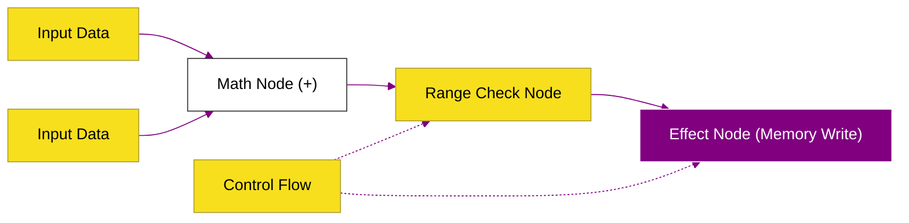

# CH-03: TurboFan (The Peak Optimizer)

> **"Kompilasi Puncak: Menyelami Arsitektur TurboFan dan Representasi Sea-of-Nodes untuk Menghasilkan Native Code dengan Performa Maksimal."**

---

## 🌓 1. Essence: The Narrative

### Dual Definition
- **Formal**: Kompiler optimasi tingkat tinggi (Top-tier JIT) pada V8 yang menggunakan representasi perantara berbasis graf (**Sea of Nodes**) untuk melakukan optimasi matematika dan logika yang sangat kompleks (seperti Inlining, Loop Unrolling, dan Range Analysis) sebelum menghasilkan instruksi mesin (*Architecture-specific machine code*).
- **Analogi**: Jika Ignition adalah **Chef yang Memasak Cepat (Interpreter)**, maka TurboFan adalah **Pabrik Manufaktur Robotik Otomatis**. Ia tidak langsung memasak; ia mengambil resep (Bytecode), menganalisis aliran data antar stasiun kerja (Sea-of-Nodes), merampingkan jalur produksi (Optimization), dan akhirnya membangun mesin yang bisa memproses pesanan secara instan dan masif.

---

## 🗺️ 2. Visual Logic: Sea of Nodes Representation

TurboFan tidak melihat kode sebagai urutan linear, melainkan sebagai aliran data dan kontrol di dalam graf:

---

## 🏛️ 3. Under-the-hood: Speculative Optimization & Bailout
Kunci kecepatan TurboFan adalah **Spekulasi**. Ia berasumsi bahwa jika Anda memberikan angka ke fungsi `add(a, b)` sebanyak 1000 kali, maka panggilan ke-1001 juga akan berupa angka. Jika asumsi ini benar, TurboFan menghasilkan kode mesin yang sangat dioptimalkan. Jika salah (misalnya Anda memasukkan string), TurboFan akan melakukan **Deoptimization (Bailout)** dan kembali ke interpreter.

---

## 📜 4. Architect's Principles (PPM V4)

1. **Be Predictable**: Pastikan tipe data input ke fungsi yang kritis tetap konsisten (Monomorphic) agar TurboFan tidak perlu sering melakukan deoptimasi.
2. **Small Functions for Inlining**: TurboFan sangat ahli dalam melakukan *Inlining* (memasukkan isi fungsi kecil langsung ke tempat pemanggilnya) untuk menghilangkan overhead pemanggilan fungsi.
3. **Avoid Hidden Class Mutations**: Perubahan struktur objek di tengah loop yang panas akan membatalkan optimasi TurboFan.

---

## 🎖️ 5. The Gold Standard Checklist
- [x] **Spec-Alignment**: Sinkronisasi dengan V8 TurboFan IR (Sea of Nodes) architecture.
- [x] **Visual Logic**: Mermaid Sea of Nodes graph.
- [x] **Mental Model**: Analogi "Pabrik Manufaktur Robotik".

---
*Status Bab: [x] Full Hardened | [status.md](../../status.md) | Kembali ke [BK-01](../README.md)*
