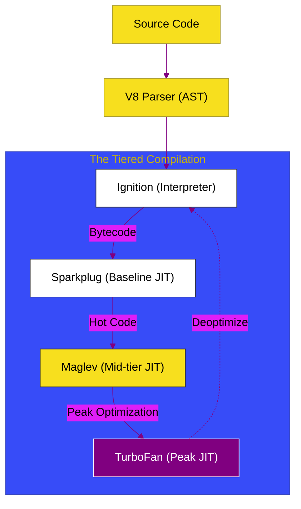

# BK-01: The Multi-tier Pipeline (Ignition & Sparkplug)

> **"Evolusi Kecepatan: Bagaimana V8 Mengubah Teks Mentah Menjadi Bytecode dan Mengoptimalkannya Secara Bertahap Melalui Jalur Multi-tier Compiler."**

---

## 🌓 1. Essence: The Narrative

### Dual Definition
- **Formal**: Arsitektur eksekusi V8 yang terdiri dari interpreter (**Ignition**) untuk eksekusi instan dan **Sparkplug** (Baseline JIT) untuk eksekusi kode non-optimasi yang lebih cepat. Pipeline ini dirancang untuk menyeimbangkan antara waktu startup yang rendah dan performa puncak yang tinggi.
- **Analogi**: Bayangkan **Menerjemahkan Buku Asing (JS Code)**. Interpreter (**Ignition**) adalah penerjemah lisan yang menerjemahkan kalimat demi kalimat secara langsung. **Sparkplug** adalah asisten yang mengetik draf kasar tanpa memedulikan gaya bahasa yang indah supaya buku cepat terbit. Ini memastikan aplikasi langsung berjalan tanpa menunggu proses translasi yang rumit di awal.

---

## 🗺️ 2. Visual Logic: The V8 Multi-tier Pipeline

Alur transformasi kode dari teks mentah hingga Machine Code:

---

## 🏛️ 3. Strategic Chapters (Levels 5)

Elemen dasar eksekusi V8:

1.  **[CH-01: Ignition Bytecode](./CH-01_ScannerParser/)**
    *Bedah bagaimana JavaScript diubah menjadi register-based bytecode.*
2.  **[CH-02: Sparkplug (Non-optimizing JIT)](./CH-03_IgnitionTurboFan/)**
    *Mekanisme "Fast Startup" tanpa overhead optimasi spekulatif.*

---

## 🧠 4. Under-the-hood: Why Sparkplug?
Sebelum adanya **Sparkplug** (V8 v9.1), V8 hanya memiliki Ignition dan TurboFan. Ini menciptakan "Optimization Gap". **Sparkplug** hadir sebagai baseline compiler yang tidak melakukan optimasi berat; ia hanya mengubah bytecode Ignition langsung menjadi machine code mentah dengan memetakan setiap instruksi bytecode ke instruksi mesin. Hasilnya? Eksekusi 5-10x lebih cepat daripada interpreter murni tanpa menunggu analisis TurboFan yang lama.

---

## 🎖️ 5. The Gold Standard Checklist
- [x] **Spec-Alignment**: Sinkronisasi dengan V8 internals (Post-2021 update).
- [x] **Visual Logic**: Mermaid diagram V8 Multi-tier Pipeline.
- [x] **Mental Model**: Analogi "Penerjemah Lisan & Draf Kasar".

---
*Buku Status: [x] Complete | [status.md](../../status.md) | Kembali ke [SR-01](../README.md)*
