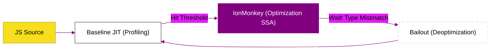

# CH-01-02: SpiderMonkey Pipeline (Baseline & Ion)

> **"Evolusi Legenda: Memahami Arsitektur SpiderMonkey (Mesin Firefox) dan Pipeline Optimasi IonMonkey yang Pionir."**

---

## 🌓 1. Essence: The Narrative

### Dual Definition
- **Formal**: Pipeline eksekusi pada mesin **SpiderMonkey** yang menggunakan arsitektur bertingkat dari interpreter C++, **Baseline JIT** (profiling di tingkat bytecode), hingga **IonMonkey** (kompiler optimasi berbasis SSA) untuk menghasilkan eksekusi JavaScript yang aman dan berperforma tinggi.
- **Analogi**: Bayangkan **Detektif dan Ilmuwan (Profiling Flow)**. **Baseline JIT** adalah Detektif yang terus berjalan mengumpulkan barang bukti (tipe data) sambil mengintai. Jika bukti sudah cukup kuat, ia mengirimkan file kasus ke **IonMonkey** (Ilmuwan), yang melakukan analisis matematika mendalam (Optimization) untuk membuktikan teori tercepat dalam mengeksekusi kode tersebut.

---

## 🗺️ 2. Visual Logic: The Optimization Flow

Alur progresif dari SpiderMonkey:

---

## 🏛️ 3. Under-the-hood: CacheIR Mechanism
Rahasia kecepatan SpiderMonkey terletak pada **CacheIR**. Ini adalah representasi perantara satu-tier yang digunakan oleh Baseline JIT untuk menangani Inline Caching (IC). CacheIR memungkinkan SpiderMonkey untuk "mengingat" pola akses objek dengan sangat efisien, sehingga saat IonMonkey dipanggil, ia sudah memiliki data yang sangat terstruktur untuk melakukan optimasi mendalam.

---

## 📜 4. Architect's Principles (PPM V4)

1. **SpiderMonkey favors Security**: Arsitektur JIT Firefox sering kali mengorbankan sedikit kecepatan untuk mekanisme keamanan yang lebih ketat dibandingkan V8.
2. **Profile-Guided Optimization (PGO)**: IonMonkey sangat bergantung pada kualitas profil dari Baseline. Kode yang "berantakan" (Mega-morphic) akan membuat IonMonkey menyerah dan menetap di eksekusi Baseline.
3. **Respect the Firefox Soul**: Memahami SpiderMonkey berarti menghargai sejarah panjang pionir JIT yang telah membentuk standar web modern.

---

## 🎖️ 5. The Gold Standard Checklist
- [x] **Spec-Alignment**: Sinkronisasi dengan Mozilla SpiderMonkey (Firefox) internal architecture documentation.
- [x] **Visual Logic**: Mermaid Optimization Flow diagram.
- [x] **Mental Model**: Analogi "Detektif dan Ilmuwan".

---
*Status Bab: [x] Full Hardened | [status.md](../../../status.md) | Kembali ke [BK-02](../README.md)*
