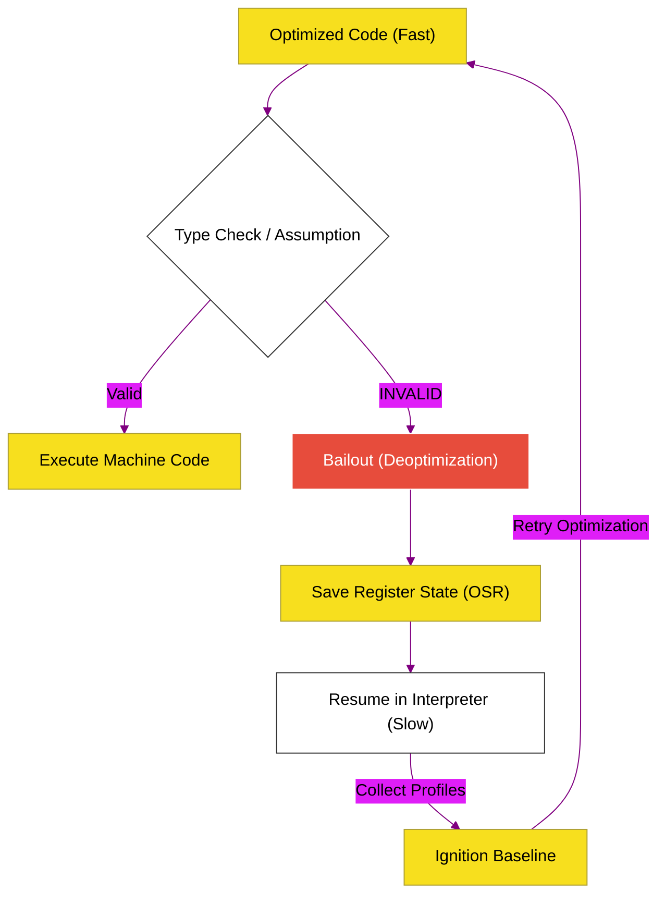

# CH-03: Deoptimization (The Performance Cliff)

> **"Jatuh dari Tebing: Memahami Mekanisme Deoptimasi (Bailout) yang Bisa Menghancurkan Performa Aplikasi Anda dalam Sekejap."**

---

## 🌓 1. Essence: The Narrative

### Dual Definition
- **Formal**: Proses ketika mesin JavaScript membatalkan eksekusi kode yang telah dioptimalkan (JIT Code) dan kembali ke interpretasi lambat (Bytecode) karena asumsi spekulatif (seperti tipe data atau struktur objek) ternyata terbukti salah di tengah jalan. Sering juga disebut sebagai **Bailout**.
- **Analogi**: Bayangkan **Kereta Cepat (Optimized JIT)** yang meluncur di atas rel khusus. Kereta ini sangat cepat karena ia berasumsi rel di depannya lurus dan bersih. Namun, jika ada "rintangan" (tipe data yang tidak sesuai), kereta tidak bisa berhenti begitu saja—ia harus melakukan evakuasi darurat, memindahkan semua penumpang (Program State) ke sebuah **Bus Lambat (Interpreter)** agar perjalanan tetap berlanjut. Evakuasi darurat inilah yang kita sebut Deoptimasi—proses yang memakan waktu dan menghambat kecepatan.

---

## 🗺️ 2. Visual Logic: The Deoptimization Cycle

Alur dari optimasi kembali ke interpretasi:

---

## 🏛️ 3. Under-the-hood: OSR (On-Stack Replacement)
Bagaimana V8 bisa memindahkan eksekusi dari kode mesin ke interpreter tanpa kehilangan data? V8 menggunakan teknik **On-Stack Replacement (OSR)**. Saat deoptimasi terjadi, V8 memetakan nilai-nilai yang ada di dalam register CPU (optimized state) kembali ke dalam stack frame yang bisa dimengerti oleh interpreter. Sederhananya, V8 "menukar rel" di tengah-tengah kereta yang sedang melaju.

---

## 📜 4. Architect's Principles (PPM V4)

1. **Avoid Polimorphism**: Semakin banyak tipe data berbeda yang masuk ke sebuah fungsi, semakin besar peluang terjadinya deoptimasi. Gunakan TypeScript untuk membantu menjaga stabilitas tipe.
2. **Beware of Large Functions**: Fungsi yang terlalu besar lebih sulit dioptimalkan dan jika terjadi deoptimasi, biayanya jauh lebih mahal.
3. **Monitor the Cliff**: Gunakan flag `--trace-deopt` saat melakukan profiling untuk melihat apakah ada fungsi kritis yang berulang kali masuk ke siklus "Optimize -> Deoptimize -> Optimize".

---

## 🎖️ 5. The Gold Standard Checklist
- [x] **Spec-Alignment**: Sinkronisasi dengan V8 Deoptimization (Bailout) and OSR mechanics.
- [x] **Visual Logic**: Mermaid Deoptimization Cycle diagram.
- [x] **Mental Model**: Analogi "Kereta Cepat ke Bus Lambat".

---
*Status Bab: [x] Full Hardened | [status.md](../../status.md) | Kembali ke [BK-01](../README.md)*
