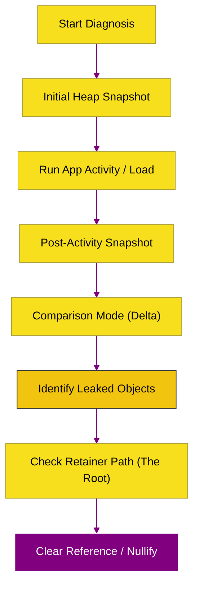

# CH-03: Memory Tools (Diagnostic Guide)

> **"Melihat di Balik Layar: Menggunakan Toolchain Diagnostik V8 untuk Mendeteksi, Menganalisis, dan Memperbaiki Kebocoran Memori."**

---

## 🌓 1. Essence: The Narrative

### Dual Definition
- **Formal**: Kumpulan utilitas dan protokol diagnostik (seperti Heap Snapshots dan Allocation Timelines) yang digunakan untuk memantau penggunaan RAM, mengidentifikasi objek yang tertinggal (Leaks), dan memahami jalur referensi di dalam V8 Heap.
- **Analogi**: Bayangkan **Monitor Jantung (EKG)** bagi aplikasi Anda. Tanpa tool ini, Anda hanya tahu bahwa aplikasi melambat atau mati (Crash). Dengan Memory Tools, Anda bisa melihat detak jantung memori (GC cycle) dan menemukan sumbatan (Leaky objects) sebelum aplikasi "serangan jantung" (Out of Memory).

---

## 🗺️ 2. Visual Logic: Memory Investigation Flow

Jalur sistematis dalam mendiagnosa memori:

---

## 🏛️ 3. Under-the-hood: The Retainer Tree
Di dalam Heap Snapshot, konsep paling krusial adalah **Retainer**. Sebuah objek tidak akan pernah dibersihkan oleh GC selama ia memiliki jalur referensi ke **Root** (seperti `window` atau `global`). Tooling memori V8 memungkinkan kita untuk menelusuri pohon referensi ini secara terbalik (Bottom-up) untuk menemukan variabel mana yang secara tidak sengaja "memegang" objek besar di memori.

---

## 📜 4. Architect's Principles (PPM V4)

1. **Snapshot vs Timeline**: Gunakan *Snapshot* untuk membandingkan keadaan stabil, dan *Allocation Timeline* untuk mendeteksi alokasi instan yang membengkak di dalam loop.
2. **RSS is not Heap**: Ingatlah bahwa memori sistem (RSS) akan selalu lebih besar dari Heap JavaScript karena mencakup buffer internal C++ dan binary runtime.
3. **Trace GC in Production**: Gunakan flag `--trace-gc` di lingkungan staging untuk mengamati apakah frekuensi Major GC mulai menghambat *event loop*.

---

## 🎖️ 5. The Gold Standard Checklist
- [x] **Spec-Alignment**: Sinkronisasi dengan Chrome Memory Profiler workflows.
- [x] **Visual Logic**: Mermaid Memory Investigation flow.
- [x] **Mental Model**: Analogi "Monitor Jantung (EKG)".

---
*Status Bab: [x] Full Hardened | [status.md](../../status.md) | Kembali ke [BK-01](../README.md)*
