# JavaScript Knowledge Base

> **"Mastering the Web's Language: From Syntax to Metaprogramming."**

## Latar Belakang & Visi
JavaScript adalah fondasi dari web modern. Repositori ini bertujuan untuk membedah kompleksitas JavaScript (ESM, Closures, Prototypes, Meta-programming) menggunakan standar **MDN Web Docs** sebagai sumber kebenaran tunggal.

## Struktur Perpustakaan (14-Rack Architecture: 11 Core + 3 Spec)

```mermaid
graph TD
    Root["JavaScript Knowledge Base"]
    
    RAK01["RAK-01-get-started<br/>(The Entry)"]
    RAK02["RAK-02-js-guide<br/>(The Handbook)"]
    RAK03["RAK-03-built-ins<br/>(The Library)"]
    RAK04["RAK-04-expressions<br/>(The Logic)"]
    RAK05["RAK-05-statements<br/>(The Flow)"]
    RAK06["RAK-06-functions<br/>(The Engine)"]
    RAK07["RAK-07-classes<br/>(The Blueprint)"]
    RAK08["RAK-08-iterations<br/>(The Cycle)"]
    RAK09["RAK-09-regex<br/>(The Pattern)"]
    RAK10["RAK-10-advanced<br/>(The Meta)"]
    RAK12["RAK-12-core-spec<br/>(The Internal)"]
    RAK13["RAK-13-runtimes<br/>(The Runtime)"]
    RAK14["RAK-14-engines<br/>(The Mechanic)"]
    
    Root --> RAK01 & RAK02 & RAK03 & RAK04 & RAK05 & RAK06 & RAK07 & RAK08 & RAK09 & RAK10 & RAK11 & RAK12 & RAK13 & RAK14
    
    style Root fill:#f7df1e,stroke:#333,stroke-width:4px,color:#000
    style RAK01 fill:#fff,stroke:#333
    style RAK02 fill:#fff,stroke:#333
    style RAK03 fill:#fff,stroke:#333
```

## Roadmap & Status Pengembangan

| Rak | Deskripsi | Status |
| :--- | :--- | :--- |
| `RAK-01-get-started/` | JS First Steps & Basics | *Planned* |
| `RAK-02-js-guide/` | Functional & Modular Guides | *Planned* |
| `RAK-03-built-ins/` | Global Objects Reference | *Planned* |
| `RAK-04-expressions/` | Operators & Evaluation | *Planned* |
| `RAK-05-statements/` | Control Flow & Declarations | *Planned* |
| `RAK-06-functions/` | Scopes, Closures, & Arrows | *Planned* |
| `RAK-07-classes/` | Prototypes & OOP | *Planned* |
| `RAK-08-iterations/` | Iterators & Generators | *Planned* |
| `RAK-09-regex/` | Regular Expression Patterns | *Planned* |
| `RAK-10-advanced/` | Meta-programming & Memory | *Planned* |
| `RAK-11-evolution/` | ES6 to ESNext & TC39 | *Planned* |
| `RAK-12-core-spec/` | ECMA-262 Deep Internals | *In Progress* |
| `RAK-13-runtimes/` | Node.js, Bun, & Deno | *In Progress* |
| `RAK-14-engines/` | V8, JIT, & Memory | *Planned* |

---
*Dokumentasi Lengkap: [docs/README.md](./docs/README.md)*
